# Personal Micro-Automation Agent: Hackathon Architecture

This document describes the hackathon solution boundary. The canonical Ouroboros
runtime map remains [`ARCHITECTURE.md`](ARCHITECTURE.md); the jury requirements and
their authoritative statuses remain in
[`HACKATHON_REQUIREMENTS.md`](HACKATHON_REQUIREMENTS.md).

## Evidence language

- **Observed**: confirmed in the current worktree or by a local command.
- **Planned**: target design; it must not be presented as working functionality.
- **Evidence placeholder**: an artifact that still has to be generated and verified.
- **Mock**: deterministic synthetic substitute for a corporate integration.

The current `skills/personal_evolution_engine/` prototype is **Observed** to run a
standard-library-only demonstration over 144 synthetic events in 36 cases. It reports
three exact-signature patterns, verifies one proposal on 12 cases, accepts an explicit
confirmation phrase, and produces a draft with no external writes. The command used
for this observation is:

```bash
python3 skills/personal_evolution_engine/scripts/demo.py
```

This observation is not evidence for the full target architecture. In particular,
the current prototype does not yet implement the required 14-field trace, variation-
tolerant pattern mining, a generated on-disk skill tree, an independently reviewed
v1-to-v2 evolution, or a real corporate connector.

## Product boundary and rationale

The solution is an Ouroboros extension, not a second orchestration platform. Domain
logic is deterministic where repeatability matters; Ouroboros supplies the agent loop,
tool execution, reviewed Skill lifecycle, task delegation, memory/context, safety
layers, evidence logging, budget accounting, and rollback/review paths.

The architectural split is deliberate:

1. **Deterministic domain plane** mines patterns, performs financial calculations,
   validates schemas, computes diffs, and scores test results. This keeps demo results
   reproducible and inspectable.
2. **Ouroboros control plane** plans work, delegates bounded roles, invokes tools,
   reviews generated capabilities, enforces core safety boundaries, and records
   evidence. Reimplementing these mechanisms inside the extension would create a
   weaker parallel authority.
3. **Human decision plane** owns approval, rejection, promotion, rollback, and every
   consequential external write.

## Target data flow

```mermaid
flowchart LR
    A["Synthetic JSON/CSV digital trace"] --> B["Trace ingestion and validation"]
    B --> C["Deterministic pattern miner"]
    C --> D["Automation hypothesis"]
    D --> E["Employee approves hypothesis"]
    E --> F["Ouroboros Micro-Skill Builder"]
    F --> G["Sandbox and independent review"]
    G --> H["Employee approves exact version and plan"]
    H --> I["Controlled draft execution"]
    I --> J["Quality and value evidence"]
    J --> K["Evolution proposal"]
    K --> G
```



No arrow authorizes a write implicitly. A rejected, stale, changed, or unverified
artifact returns to review. **Planned:** approval receipts will bind the skill version,
input hash, action plan, permissions, expiry, and expected diff. The current exact
`APPROVE <proposal_id>` phrase is a prototype gate, not yet such a receipt.

## Target components

| Component | Responsibility | Execution mode | Current status |
|---|---|---|---|
| Trace Ingestion | Validate the 14-field schema, redact prohibited fields, construct cases | Deterministic, local | Planned; current prototype accepts a different six-field schema |
| Pattern Miner | Discover repeated and similar sequences without receiving labels | Deterministic, local | Planned upgrade; current baseline groups exact signatures |
| Hypothesis Agent | Explain value, risk, permissions, stable/variable steps, and human steps | Ouroboros-guided with deterministic facts | Partially observed as a proposal dictionary; target card is planned |
| Micro-Skill Builder | Generate a complete versioned skill payload and tests | Ouroboros Skill workflow | Planned; current proposal is not an on-disk executable skill |
| Sandbox Test Agent | Execute historical fixtures and compare expected/actual/diff | Isolated local test lane | Planned; current verification is logical matching, not OS isolation |
| Safety Agent | Enforce data, permission, action, secret, injection, and budget policy | Core gates plus domain checks | Core controls observed; domain evidence is planned |
| Execution Agent | Run only a reviewed, enabled, approved version | Draft-only in MVP | Current prototype returns a simulated draft and no writes |
| Quality Reviewer | Judge output against skill-specific acceptance criteria | Independent Ouroboros task/reviewer | Planned |
| Evolution Agent | Produce v2 from a bounded defect and compare regressions | Versioned skill payload only | Planned; current feedback only changes a recommendation candidate |
| Value Tracker | Separate measured, simulated, estimated, and target metrics | Deterministic telemetry | Planned |

## Why Ouroboros is indispensable

| Ouroboros capability | Product use | Claim discipline |
|---|---|---|
| Agent task loop and planning | Turns an approved hypothesis into an evidence-producing build/test/review task | Core capability exists; product workflow remains planned until evidenced |
| Internal subagents and task-tree ledger | Bounded Trace, Builder, Test, Safety, Reviewer, and Evolution roles exchange typed findings | Core capability exists; the extension does not currently schedule this role graph |
| Skill loader, preflight, review, grants, enablement | Generated capabilities are reviewed and owner-enabled before execution | Core capability exists; generated skill evidence is planned |
| Tool policy and safety checks | Restricts file, process, browser, MCP, and extension operations | Core capability exists; it does not replace domain RBAC or DLP |
| Usage accounting and budget rails | Records physical model attempts and prevents uncontrolled spend | Core capability exists; the stricter USD 5 hackathon guard is planned |
| Forensic traces and verification receipts | Links claims to host-attested executions and artifacts | Core capability exists; hackathon evidence bundle is planned |
| Review and rollback | Reviews mutations and restores known versions | Core capability exists; micro-skill v1/v2 rollback proof is planned |
| BIBLE governance | Keeps agency, continuity, review integrity, and owner control in scope | Existing constitutional boundary, not a marketing add-on |

### A2A caveat

Ouroboros currently supports **internal role delegation** through scheduled subagents,
bounded capability envelopes, task-tree communication, and parent-owned integration.
It does **not** ship a general external Agent-to-Agent transport. Therefore:

- the demo may call this an internal multi-agent workflow;
- it must not claim interoperability with an external A2A protocol;
- MCP describes tool/connectivity boundaries, not agent-to-agent transport;
- until the extension schedules and evidences these roles, the current prototype is
  one extension module, not a demonstrated multi-agent deployment.

Jury-facing explanation:

> **Роль Ouroboros.** Платформа не просто генерирует текст. Она должна планировать
> создание микронавыка, делегировать независимую проверку, запускать тесты,
> применять политики безопасности, сохранять доказательства и предлагать новую
> версию только через контролируемый жизненный цикл. В текущем прототипе часть
> этого контура ещё обозначена как план и не выдаётся за готовую интеграцию.

## Data boundaries

The MVP uses synthetic data only. The target event contract is documented in
[`pattern-mining.md`](pattern-mining.md). Raw traces are processed locally and should
be discarded after feature extraction; durable state contains aggregates, hashes,
versioned skills, approvals, and audit references. Corporate systems are represented
by visibly labelled mock adapters.

The flagship Credit Analyst path prepares evidence, calculations, risk flags, a task
draft, and an email draft. It does not make a credit decision, invent missing values,
send mail, change a record, or elevate permissions.

## AS IS / TO BE

The Proposal benchmark of 45 minutes AS IS and 18 minutes target TO BE is a **target**,
not a measured result. Measured demo telemetry must be reported separately.

> **AS IS:** кредитный аналитик вручную ищет отчёты и выписки, сверяет лимиты и
> ковенанты, переносит показатели в персональный шаблон, проверяет стоп-факторы,
> готовит комментарий, задачу и письмо.
>
> **TO BE:** агент собирает разрешённые синтетические данные, проверяет полноту,
> выполняет детерминированные расчёты, показывает противоречия и доказательства,
> формирует только черновики и запрашивает подтверждение сотрудника. Финальная
> проверка и решение остаются у уполномоченного человека.

## Evidence still required

| Claim | Required evidence | Status |
|---|---|---|
| Variation-tolerant mining of at least three patterns | Fixture corpus, ground truth, precision/recall/FPR report | Evidence placeholder |
| Complete on-disk micro-skill generation | Generated tree, hashes, schema validation, tests | Evidence placeholder |
| Internal role delegation | Task tree with role contracts and independent reviewer result | Evidence placeholder |
| Approve-before-run cannot be bypassed or replayed | Negative tests and bound approval receipt | Evidence placeholder |
| v1 defect, v2 correction, promotion, rollback | Same-basket before/after report and rollback test | Evidence placeholder |
| Business effect | Provenance-labelled AS IS/TO BE telemetry | Evidence placeholder |
| Stable final path | Three consecutive end-to-end runs | Evidence placeholder |

## Known limitations

- All business data and connectors are synthetic or mocked.
- Exact-signature mining is the observed baseline and does not prove robustness to
  variations or noise.
- The current proposal is structured data, not a generated reviewed Skill directory.
- The current “sandbox” performs deterministic checks in-process; it is not proof of
  process, container, or network isolation.
- No external A2A interoperability is claimed.
- No real email, task, CRM, BPM, document, spreadsheet, or BI write is performed.
- Projected time savings must remain labelled as target or estimate until measured.
