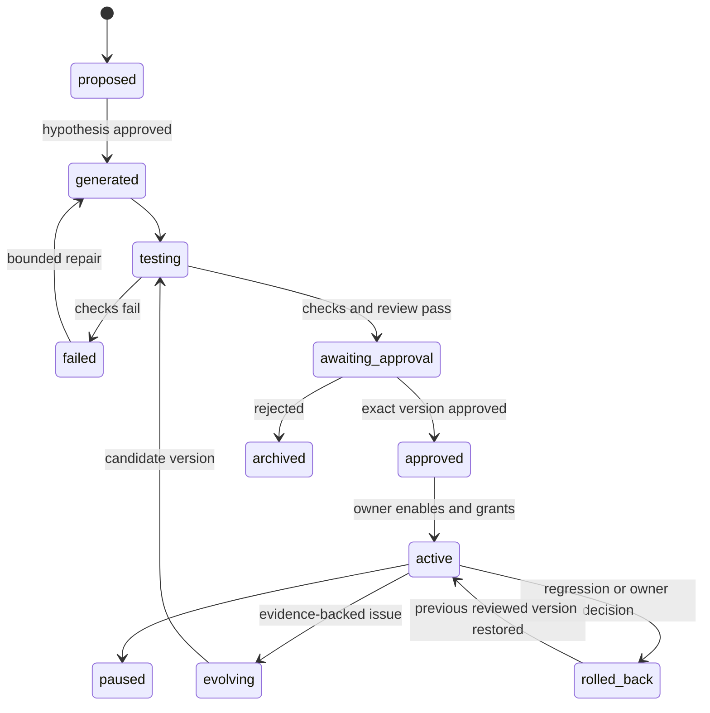

# Micro-Skill Lifecycle

## Design intent

A micro-skill is a small, employee-scoped, versioned capability generated from a
verified pattern. It is not executable merely because files were generated. The
Ouroboros Skill lifecycle—discovery, preflight, review, grants, enablement, execution,
health, and disablement—remains the host authority.

**Observed baseline:** the current extension stores a structured proposal in private
state, verifies exact-signature cases, accepts `APPROVE <proposal_id>`, and returns a
draft-only result.

**Planned target:** create a complete on-disk tree, execute its code in an isolated
test lane, obtain independent review, bind approval to the exact version and input,
promote v2 after measurable improvement, and prove rollback. A proposal dictionary is
not a generated Skill.

## Target payload

```text
skills/generated/<skill_id>/
├── SKILL.md
├── manifest.yaml
├── identity.md
├── workflow.yaml
├── input_schema.json
├── output_schema.json
├── permissions.yaml
├── safety_policy.yaml
├── evaluation.yaml
├── prompts/
├── src/
├── tests/
├── fixtures/
├── versions/
├── CHANGELOG.md
└── README.md
```

This path is **Planned**. Generation is complete only when the tree exists, hashes are
recorded, schemas validate, tests execute, and review evidence names the same payload
hash.

The manifest must identify the source pattern, owner reference, version, status,
required tools and permissions, time-saving estimate classification, risk/autonomy
level, approval time, and rollback version. Personal source data is never copied into
the reusable template.

## State machine



No transition is inferred from prose. Status, payload hash, review verdict, grants,
approval receipt, and test results are structured facts.

## Build contract

1. Pattern Miner emits immutable pattern evidence and a provenance hash.
2. The employee approves the automation hypothesis, not execution.
3. Ouroboros plans the smallest skill that covers stable steps and exposes variable
   fields in schemas.
4. Builder generates files under a new version directory; it cannot overwrite the
   active reviewed payload.
5. Static validation checks schema, imports, manifest consistency, licences, secrets,
   and path confinement.
6. Sandbox tests run historical fixtures and record expected, actual, diff, errors,
   permissions, injection checks, cost, and duration.
7. An independent reviewer judges the same immutable artifact. The builder cannot
   review its own output as the sole authority.
8. Owner approval binds the exact artifact and execution plan.
9. Execution produces a draft and a complete audit trail. External writes are out of
   scope for the submission MVP.

## Ouroboros mapping

| Lifecycle need | Ouroboros mechanism | Product status |
|---|---|---|
| Planning and generation | Main task loop plus Skill authoring conventions | Planned workflow |
| Independent roles | Internal subagents with bounded capabilities | Core exists; product evidence planned |
| Payload validation | Skill preflight and deterministic checks | Core exists; generated payload planned |
| Trust decision | Tri-model Skill review and live content hash | Core exists; verdict placeholder |
| Permission | Owner grants and enablement | Core exists; generated skill not yet enabled |
| Execution | Reviewed Skill/tool substrate | Core exists; domain executor planned |
| Evidence | Tool logs, task-tree beacons, verification receipts | Core exists; bundle placeholder |
| Rollback | Versioned payload plus host review/rollback paths | Planned micro-skill proof |

Internal subagents are not external A2A peers. They communicate through Ouroboros task
contracts and task-tree state. No external A2A protocol support is claimed.

## Sandbox and quality gates

The target test record for every case contains:

- fixture id and input hash;
- expected output;
- actual output;
- structured diff;
- schema and deterministic-calculation results;
- leakage, secret, injection, and permission checks;
- tool results, cost, and duration;
- reviewer verdict and evidence references.

At least ten anonymized real-process-shaped cases are required by the regulations;
the project target is 20+ synthetic scenarios. The current matching check verifies 12
cases, but it does not yet compare rich expected/actual business outputs.

## Approval and execution

Approval of a hypothesis, approval of a skill version, and approval of an execution
are separate decisions. The MVP defaults to A1–A3:

- A1 recommends an automation;
- A2 prepares a visible draft;
- A3 executes only after exact-plan approval;
- A4 autonomous execution is out of scope.

The flagship executor may collect synthetic evidence, fill a mini-dossier, run
deterministic covenant/stop-factor checks, flag contradictions, and prepare task/email
drafts. It may not make a credit decision, invent a missing number, send mail, commit a
source-system change, or broaden permissions.

## Safe evolution

Evolution is confined to a specific micro-skill version. It never silently edits the
Ouroboros core or the active production payload.

Target demonstration:

1. v1 intentionally misses one controlled contradiction.
2. A fixture or independent reviewer records the failure.
3. Evolution proposes a root-cause-specific change in permitted files only.
4. v2 is generated beside v1.
5. Both versions run against the same golden basket.
6. Safety and quality reviewers compare before/after metrics and check regressions.
7. The employee sees the diff and decides whether to promote v2.
8. Rollback restores the previous reviewed version and reruns a smoke case.

The current `record_feedback` output only recommends ranking changes and explicitly
does not modify code, permissions, integrations, or workflows. It is not evidence of
the target evolution cycle.

Jury-facing explanation:

> **Жизненный цикл микронавыка.** Найденный паттерн сначала становится гипотезой.
> После подтверждения Ouroboros создаёт отдельную версию навыка, его схемы,
> разрешения и тесты. Навык проверяется на истории и независимым ревьюером, а
> запуск разрешается только для конкретной версии и плана. Улучшение создаёт новую
> версию рядом со старой; продвижение и откат остаются решением сотрудника.

## Evidence placeholders

| Gate | Required artifact |
|---|---|
| Generated | Full file tree, manifest, hashes |
| Testing | Per-case expected/actual/diff report |
| Reviewed | Independent review verdict bound to hash |
| Approved | Non-replayable approval receipt |
| Active | Execution audit with no unapproved writes |
| Evolved | v1/v2 same-basket comparison |
| Rolled back | Restored hash and passing smoke receipt |

## Limitations

- The current extension proposal is not an executable generated directory.
- Current verification checks workflow signatures and positive durations, not the full
  Credit Analyst output contract.
- There is no demonstrated independent reviewer or bound approval receipt yet.
- There is no demonstrated v1-to-v2 promotion or rollback yet.
- Corporate connector execution is a documented future boundary; the MVP remains
  draft-only.
